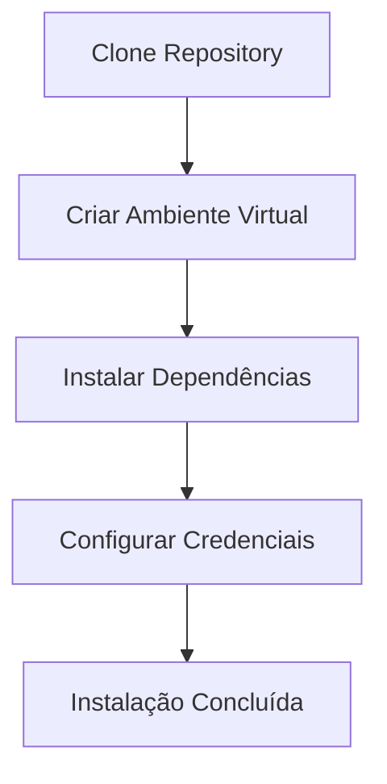
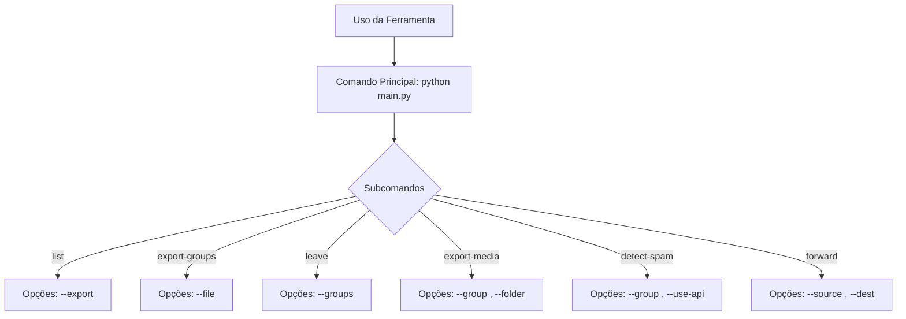

# Telegram CLI Admin Tool

Uma ferramenta de linha de comando (CLI) para administrar sua conta do Telegram, permitindo gerenciar grupos, exportar mídias, detectar spam e muito mais.

## Índice

- [Funcionalidades](#funcionalidades)
- [Instalação](#instalação)
- [Uso](#uso)
- [Contribuição](#contribuição)
- [Licença](#licença)

## Funcionalidades

- **Listar Grupos e Conversas**: Visualize todos os seus grupos e conversas em uma tabela e exporte a lista para `json`, `yaml` ou `csv`.
- **Exportar Detalhes de Grupos**: Exporte informações detalhadas sobre seus grupos, como tipo, número de membros e data de criação.
- **Sair de Grupos em Massa**: Saia de múltiplos grupos de uma só vez.
- **Exportar Mídias**: Baixe mídias de um grupo específico, com controle de taxa de download.
- **Detecção de Spam**: Verifique mensagens suspeitas de spam em um grupo, usando heurísticas locais ou uma API externa.
- **Encaminhar Conteúdo**: Copie conteúdo de um grupo para outro.

## Instalação

1. **Clone o repositório:**

   ```bash
   git clone https://github.com/seu-usuario/telecli-admin.git
   cd telecli-admin
   ```

2. **Crie um ambiente virtual e instale as dependências:**

   ```bash
   python -m venv .venv
   source .venv/bin/activate
   pip install -r requirements.txt
   ```

   *Nota: Se você usa `uv`, pode usar `uv pip install -r requirements.txt`.*

3. **Configure suas credenciais da API do Telegram:**
   - Edite o arquivo `telecli_admin/config.py`.
   - Insira seu `API_ID` e `API_HASH` que você pode obter em [my.telegram.org](https://my.telegram.org).



## Uso

Execute a ferramenta a partir do diretório raiz do projeto.

**Listar grupos e conversas:**

```bash
python main.py list
```

Para exportar a lista:

```bash
python main.py list --export json
```

**Exportar detalhes dos grupos:**

```bash
python main.py export-groups --file meugrupos.json
```

**Sair de grupos:**

```bash
python main.py leave --groups 12345678,87654321
```

*Nota: Use os IDs dos grupos, que você pode obter com o comando `list`.*

**Exportar mídias de um grupo:**

```bash
python main.py export-media --group 12345678 --folder /caminho/para/salvar
```

**Detectar spam em um grupo:**

```bash
python main.py detect-spam --group 12345678
```

Para usar a API externa (se configurada):

```bash
python main.py detect-spam --group 12345678 --use-api
```

**Encaminhar conteúdo:**

```bash
python main.py forward --source 12345678 --dest 87654321
```



## Contribuição

Contribuições são bem-vindas! Para contribuir:

1. Fork o repositório
2. Crie uma branch para sua feature (`git checkout -b feature/nome`)
3. Commit suas mudanças (`git commit -m 'Adicionar feature'`)
4. Push para a branch (`git push origin feature/nome`)
5. Abra um Pull Request

Siga as diretrizes de contribuição do projeto para garantir que sua contribuição seja aceita.

## Licença

Este projeto está licenciado sob a MIT License - veja o arquivo [LICENSE](LICENSE) para detalhes.
